# 🎵 Video to Audio Converter

A full-stack web application that converts video files into audio files using FFmpeg.

Built using the MERN stack and media processing tools.

---

# 🚀 Features

- Upload video files
- Convert video to MP3 audio
- Download converted audio
- File upload handling using Multer
- Media processing using FFmpeg
- CTA button for audio download
- Responsive frontend UI

---

# 🛠️ Tech Stack

## Frontend
- React.js
- Fetch API
- CSS 

## Backend
- Node.js
- Express.js
- Multer
- FFmpeg
- CORS

---

# 📂 Project Flow



## 1. User uploads video
The frontend sends the selected video file to the backend using `FormData`.

## 2. Multer handles upload
Multer receives and stores the uploaded file in the `uploads/` folder.

## 3. FFmpeg processes the file
FFmpeg extracts the audio from the uploaded video and converts it into MP3 format.

## 4. Audio file is generated
The converted audio file is stored inside the `converts/` folder.

## 5. Download 
The frontend receives the audio blob and downloads the converted MP3 file using download button.

---

# 🧠 What I Learned

Through this project, I learned:

- How file uploads work in Node.js using Multer
- How to use Multer middleware for local file storage
- Difference between `multipart/form-data` and JSON
- How FFmpeg works with Node.js
- Blob and Object URLs in frontend
- File download from web applications
- Working with binary data
- Path and file operations in Node.js

---

# ⚠️ Problems I Faced

## 1. Uploaded files had no extension
### Problem:
Files were uploading without `.mp4` extension.

### Solution:
Used: Saved the uploaded file with its original name and extension using 'file.originalname' in Multer configuration.

```js
const storage = multer.diskStorage({
  destination: (req, file, cb) => { 
    cb(null, "uploads/");
  },
  filename: (req, file, cb) => {
    cb(null, Math.round(Math.random() * 1000) + file.originalname); 
  }
})
```
---

## 2. Converted file was not saving
### Problem:
FFmpeg conversion completed but output file was missing.

### Solution:
- Used absolute paths with `path.join()`
- To save the file in converts/ folder, used: `const outputPath = path.join(__dirname, 'converts', filename);`
---

## 3. Frontend download issue
### Problem:
Frontend was trying to parse the response as JSON, but backend was sending a file stream.

### Solution:
Used:

```js
response.blob()
```

instead of:

```js
response.json()
```

---

# 📸 Screenshots
## 1. Uploading video file
---

# 🔧 Installation

## Clone repository

```bash
git clone YOUR_GITHUB_LINK
```

## Install dependencies

### Frontend

```bash
cd frontend
npm install
npm run dev
```

### Backend

```bash
cd backend
npm install
npm node server.js or nodemon server.js
```

---

# ⚙️ Environment Setup

Install FFmpeg on your system and add it to PATH.

Installation: If you're on Windows 10/11, just open PowerShell as Administrator and run:

```bash
winget install ffmpeg
ffmpeg -version
```

---

# 📁 Folder Structure

```bash
project/
│
├── frontend/
│
├── backend/
│   ├── uploads/
│   ├── converts/
│   ├── config/
│   ├── app.js
│
└── README.md
```

---

# 🚀 Future Improvements

- Drag and drop upload
- Progress bar during conversion
- Cloudinary integration
- AWS S3 storage
- Queue system using BullMQ
- Multiple audio formats
- Trim audio functionality
- Authentication system

---

# 💡 Key Concepts Used

- File Handling
- Media Processing
- Middleware
- REST APIs
- Binary Data handling
- Streams
- Blob and Object URLs

---

# 👨‍💻 Author

Junaid Khan
